# ByteBites – Java med GitHub Copilot, MCP og lidt systemudvikling

Fork vs template (her template)

I denne workshop skal I udvikle videre på **ByteBites**, en lille Java-konsolapplikation til en foodtruck.

Det faglige mål er ikke bare at få Copilot til at skrive kode.

I skal lære et udviklingsflow, som I senere kan bruge i jeres egne projekter:

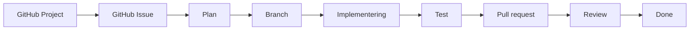

GitHub Copilot hjælper undervejs, og GitHub MCP forbinder Copilot i IntelliJ med GitHub.

---

## Det skal I lære

Efter workshoppen skal I kunne:

* oprette et simpelt Scrum-board med GitHub Projects
* oprette et GitHub Issue med tydelige acceptkriterier
* forbinde GitHub Copilot i IntelliJ med GitHub gennem MCP
* få Copilot til at hente et Issue direkte fra GitHub
* få Copilot til at planlægge en løsning før implementering
* bruge Agent mode til en afgrænset programmeringsopgave
* arbejde på en separat branch
* teste og kontrollere AI-genereret kode
* oprette en pull request
* gennemføre review før en opgave bliver `Done`

Det samlede flow er:

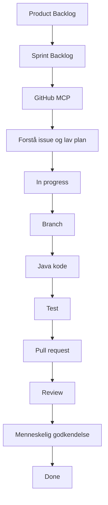

---

# En vigtig regel

I denne README findes tekster til de Issues, I skal oprette.

README'en er **ikke selve arbejdsopgaven for Copilot**.

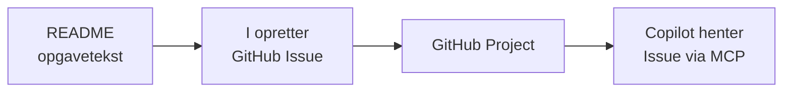

Det betyder:

**README = vejledning og opgavebank**

**GitHub Issue = den rigtige arbejdsopgave**

**GitHub Project = viser hvor arbejdet befinder sig**

**MCP = forbindelsen mellem IntelliJ og GitHub**

**Copilot Agent = hjælper med at udføre arbejdet**

Copilot må derfor ikke implementere en opgave direkte fra teksten i README'en.

Opgaven skal først oprettes som et rigtigt GitHub Issue.

---

# Workshopforløb

| Del | Aktivitet                             |
| --- | ------------------------------------- |
| 1   | Klargør Java-projektet                |
| 2   | Opret Scrum-board                     |
| 3   | Opsæt Copilot og GitHub MCP           |
| 4   | Opret Copilot-instruktioner           |
| 5   | Underviseren viser et samlet flow     |
| 6   | I gennemfører selv et nyt Issue       |
| 7   | Review og opsamling                   |
| 8   | Sådan bruger I arbejdsformen fremover |

---

# Del 1 – klargør Java-projektet

## 1. Fork projektet

Fork følgende repository til jeres egen GitHub-konto:

`https://github.com/krollchristensen/bytebites-java-starter`

Klon derefter jeres fork til IntelliJ IDEA.

## 2. Kør programmet

Projektet bruger Java 21.

Kør `Main.java`.

I skal kunne se noget i retning af:

```text
ByteBites – festivalens foodtruck

1. Vis retter
2. Opret bestilling
0. Afslut

Vælg:
```

Prøv programmet.

Undersøg kort `Main.java`, så I ved, hvad startkoden allerede kan.

---

# Del 2 – opret Scrum-boardet

I skal selv oprette et GitHub Project.

Det er vigtigt, fordi I senere skal kunne gøre det samme i jeres egne projekter.

## 1. Opret Project

Opret et nyt GitHub Project med Board-visning.

Brug følgende statusser:

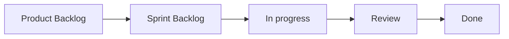

## 2. Hvad betyder kolonnerne?

| Status          | Betydning                              |
| --------------- | -------------------------------------- |
| Product Backlog | Opgaver vi kan arbejde med senere      |
| Sprint Backlog  | Opgaver vi har valgt at arbejde med nu |
| In progress     | Opgaver der bliver implementeret       |
| Review          | Implementeringen skal kontrolleres     |
| Done            | Opgaven er godkendt og afsluttet       |

Vi bruger ikke en masse ekstra Project-felter i denne workshop.

Det vigtigste er at forstå flowet.

---

# Del 3 – opsæt GitHub MCP

Normalt arbejder IntelliJ med jeres lokale kode, mens Issues og Project ligger på GitHub.

MCP forbinder de to.

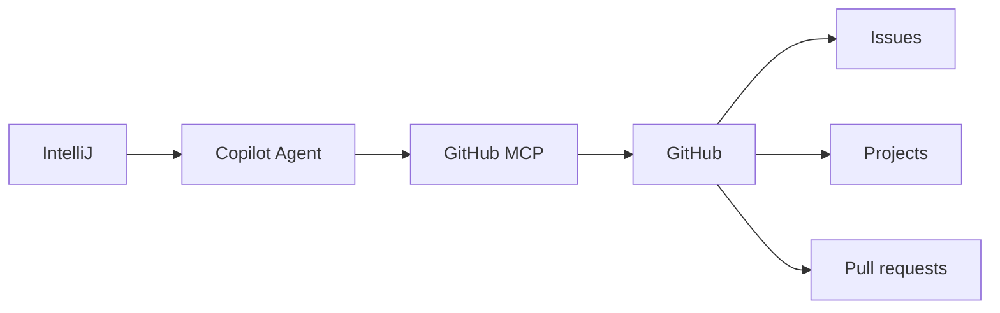

## 1. Åbn MCP-konfigurationen

Åbn GitHub Copilot Chat i IntelliJ.

Vælg:

```text
Agent
  ↓
Tools
  ↓
Configure MCP server
  ↓
Configure Tools

```
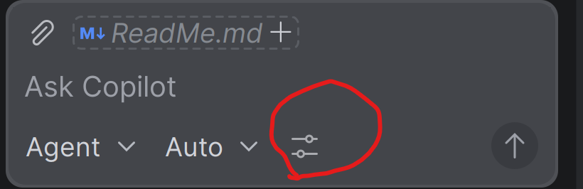
IntelliJ åbner en `mcp.json`.

## 2. Tilføj GitHub MCP

Brug:

```json
{
  "servers": {
    "github": {
      "type": "http",
      "url": "https://api.githubcopilot.com/mcp/",
      "headers": {
        "X-MCP-Toolsets": "default,projects"
      }
    }
  }
}
```

`default` giver blandt andet adgang til:

* repositories
* Issues
* pull requests
* information om GitHub-brugeren

`projects` giver adgang til GitHub Projects.
## Dokumentation

- GitHub MCP Server:
  https://docs.github.com/en/copilot/how-tos/provide-context/use-mcp-in-your-ide/use-the-github-mcp-server

- MCP toolsets:
  https://docs.github.com/en/copilot/how-tos/provide-context/use-mcp-in-your-ide/configure-toolsets

## 3. Log ind

Når GitHub Copilot beder om adgang til GitHub, skal I godkende forbindelsen.

Vi bruger GitHub-login/OAuth.

I skal ikke skrive et GitHub-token ind i projektet.

---

# Del 4 – kontroller MCP

Før vi arbejder med kode, skal vi kontrollere, at Copilot faktisk kan kommunikere med GitHub.

Åbn Copilot Chat i **Agent mode**.

Skriv:

```text
Brug GitHub MCP.

Find det GitHub Project, der hører til dette projekt.

Vis:
- Projectets navn
- de forskellige statusser
- de Issues der ligger i Projectet

Du må ikke ændre noget.
```

På dette tidspunkt er Projectet sandsynligvis tomt.

Det er fint.

Det vigtige er, at Copilot kan finde det.

---

# Del 5 – giv Copilot projektets regler

En AI-agent skal kende de regler, der gælder for projektet.

I skal derfor oprette:

```text
.github/copilot-instructions.md
```

Opret selv `.github`-mappen og filen.
Punktummet i .github betyder, at mappen er en konfigurations-/systemmappe og ikke almindelig projektkode.

Indsæt:

```markdown
# ByteBites

Dette er en enkel Java-konsolapplikation.

## Teknologi

- Brug Java 21.
- Brug ikke database.
- Brug ikke Spring Boot eller andre frameworks.
- Hold løsningen enkel og forståelig.

## GitHub workflow

Når du arbejder med en udviklingsopgave:

1. Brug et rigtigt GitHub Issue som kilde til opgaven.
2. Hent GitHub Issue gennem GitHub MCP.
3. Brug ikke README eller lokale markdown-filer som erstatning for et GitHub Issue.
4. Arbejd kun med Issues, der findes i GitHub Project.
5. Arbejd kun med det Issue, brugeren har valgt eller som er assigned til brugeren i Sprint Backlog.
6. Læs hele Issue og alle acceptkriterier før du planlægger.
7. Fortæl altid Issue-nummer og titel, før du foreslår en plan.
8. Lav en kort implementeringsplan før kode ændres.
9. Vent på brugerens godkendelse af planen.
10. Flyt Issue til In progress, når implementeringen starter.
11. Opret en separat branch til Issue.
12. Implementer kun det valgte Issue.
13. Kør relevante test efter implementering.
14. Kontroller alle acceptkriterier.
15. Referer Issue-nummeret i pull requesten.
16. Flyt Issue til Review, når pull requesten er klar.
17. Merge ikke uden menneskelig godkendelse.
18. Flyt ikke selv et Issue til Done uden menneskelig godkendelse.

## Kvalitet

AI-genereret kode er ikke automatisk korrekt.

Koden skal kunne forklares, testes og reviewes af udvikleren.
```

## Hvorfor har vi denne fil?

Prompten fortæller Copilot:

> Hvad skal du gøre lige nu?

`copilot-instructions.md` fortæller Copilot:

> Hvordan arbejder vi i dette projekt?

Det samme princip kan I senere bruge i jeres egne projekter.

---

# Del 6 – MIKC demonstrerer

Nu vises hele flowet én gang.

Intet er oprettet på forhånd.

Vi starter med et behov/krav og ender med en pull request og et færdigt Issue.

---

## Demo-issue – vis priser på retterne

MIKC opretter et nyt GitHub Issue.

### Titel

```text
Vis priser på retterne
```

### Kopier dette ind i Issue

```markdown
## Behov

Medarbejderne skal kunne se prisen på hver ret.

## Acceptkriterier

- Festivalburger vises med prisen 59 kr.
- Sprøde fritter vises med prisen 35 kr.
- Vegansk bowl vises med prisen 65 kr.
- Den eksisterende menu virker stadig.
- Løsningen skal holdes enkel.

## Afgrænsning

Der skal ikke implementeres betaling eller beregning af en samlet pris.
```

Tilføj Issue til Project.

Placér det først i:

```text
Product Backlog
```

Assign Issue til MIKC.

---

## Vælg arbejdet

Nu beslutter vi, at opgaven skal arbejdes på.

Flyt manuelt:

```text
Product Backlog
        ↓
Sprint Backlog
```

Dette er en menneskelig beslutning.

Copilot skal ikke bestemme, hvilke opgaver der er vigtigst.

---

# 1. Lad Copilot finde Issue

Gå tilbage til IntelliJ.

Åbn Copilot i Agent mode.

Skriv:

```text
Brug GitHub MCP.

Find det Issue i Sprint Backlog,
som er assigned til mig.

Brug GitHub Project og det rigtige GitHub Issue som kilde.
Brug ikke README som opgavebeskrivelse.

Fortæl mig:

1. Issue-nummer
2. Issue-titel
3. acceptkriterierne
4. hvad opgaven går ud på

Undersøg derefter den eksisterende Java-kode.

Lav til sidst en kort implementeringsplan.

Du må ikke ændre kode eller GitHub-status endnu.
```

Copilot skal nu selv:

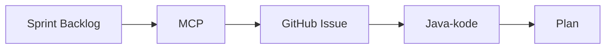

Vi kopierer altså ikke Issue-teksten ind i IntelliJ.

---

# 2. Kontroller planen

Stop inden implementering.

Læs Copilots plan.

Spørg:

* Arbejder Copilot med det rigtige Issue?
* Dækker planen alle acceptkriterier?
* Passer løsningen til den eksisterende kode?
* Er løsningen unødvendigt kompliceret?
* Foreslår Copilot noget, vi ikke har bedt om?

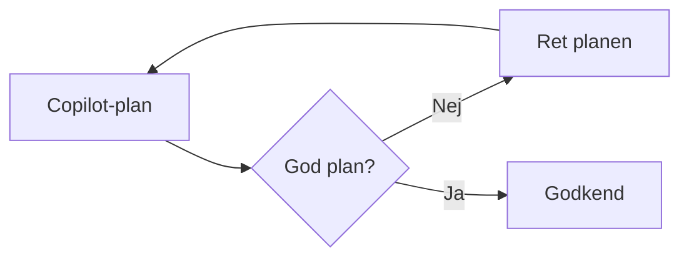

Først når planen giver mening, fortsætter vi.

---

# 3. Lad Agent implementere

Skriv:

```text
Planen er godkendt.

Arbejd nu med det valgte GitHub Issue.

1. Flyt Issue til In progress.
2. Opret en passende branch til Issue.
3. Implementer den godkendte plan.
4. Kør relevante kontroller eller test.
5. Kontroller alle acceptkriterier.

Stop derefter.

Vis:
- hvilke filer du har ændret
- hvad du har ændret
- resultatet af test
- om alle acceptkriterier er opfyldt

Commit, push og opret ikke pull request endnu.
```

Nu må Agent arbejde.

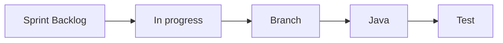

---

# 4. Kontroller Agentens arbejde

Nu stopper automatiseringen igen.

Kør programmet selv.

Kontrollér eksempelvis:

```text
Retter:
1. Festivalburger - 59 kr.
2. Sprøde fritter - 35 kr.
3. Vegansk bowl - 65 kr.
```

Kontrollér også:

* virker menuen stadig?
* kan programmet stadig afsluttes?
* kan I forklare ændringerne?
* har Agent ændret andet end nødvendigt?

En løsning er ikke færdig, bare fordi Agent skriver:

```text
Task completed successfully
```

Udvikleren skal selv kontrollere resultatet.

---

# 5. Opret pull request

Når løsningen er godkendt:

```text
Implementeringen er kontrolleret og godkendt.

Commit de relevante ændringer og push branchen.

Opret derefter en pull request til main.

Pull requesten skal:
- referere det GitHub Issue vi arbejder på
- beskrive ændringerne kort
- beskrive hvordan løsningen er testet

Flyt derefter Issue til Review.

Du må ikke merge pull requesten.
Du må ikke flytte Issue til Done.
```

Flowet bliver:

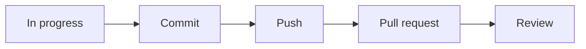

---

# 6. Review

Åbn pull requesten på GitHub.

Kontrollér:

* matcher implementeringen Issue?
* er alle acceptkriterier dækket?
* er koden forståelig?
* er der unødvendig kompleksitet?
* virker løsningen?

Copilot må gerne hjælpe med review:

```text
Review denne pull request i forhold til det tilknyttede GitHub Issue.

Kontroller især:
- acceptkriterier
- mulige fejl
- unødvendig kompleksitet
- Java-struktur

Ændr ikke kode.
```

Men den endelige beslutning ligger hos et menneske.

---

# 7. Done

Når pull requesten er godkendt:

1. merge pull requesten
2. kontrollér at Issue er afsluttet
3. flyt Issue til `Done`


Nu har I set hele flowet.

---

# Del 7 – nu arbejder I selv

Nu skal I gennemføre samme proces.

Denne gang er det jer, der styrer Agenten.

---

## Opgave – opret en bestilling

Opret først et **rigtigt GitHub Issue**.

### Titel

```text
Opret en bestilling
```

### Kopier dette ind i Issue

```markdown
## Forretningsbehov

ByteBites skal kunne registrere nye bestillinger hurtigt og korrekt,
så medarbejderne kan se, hvad der skal tilberedes.

## User story

Som medarbejder vil jeg kunne oprette en bestilling med ret og antal,
så køkkenet kan tilberede det rigtige.

## Acceptkriterier

- Brugeren kan vælge en af de tre gyldige retter.
- Brugeren kan indtaste et positivt antal.
- Bestillingen får et unikt id.
- En ny bestilling får status MODTAGET.
- Bestillingen vises efter oprettelse.
- Ugyldig ret afvises med en forståelig besked.
- Ugyldigt antal afvises med en forståelig besked.
- Programmet crasher ikke ved forkert input.
- Der kan højst gemmes ti bestillinger.

## Afgrænsning

Bestillinger gemmes kun i hukommelsen.

Issuet omfatter ikke:
- database
- betaling
- web
- Spring Boot
- ændring af en bestillings status

## Test

Kontroller mindst:

- gyldig ret og antal 2
- ugyldigt valg af ret
- antal 0
- negativt antal
- tekst i stedet for antal
- to bestillinger får forskellige id'er
- bestilling nummer 11 afvises
```

---

# 1. Tilføj Issue til Scrum-boardet

Assign Issue til jer selv.

Tilføj det til Project.

Start i:

```text
Product Backlog
```

Når I beslutter at arbejde med opgaven:

```text
Product Backlog
        ↓
Sprint Backlog
```

---

# 2. Lad Copilot hente Issue

Brug samme princip som i demonstrationen.

```text
Brug GitHub MCP.

Find det Issue i Sprint Backlog,
som er assigned til mig.

Brug det rigtige GitHub Issue som opgavekilde.
Brug ikke README som opgavebeskrivelse.

Fortæl Issue-nummer og titel.

Læs hele Issue og alle acceptkriterier.

Undersøg derefter den eksisterende Java-kode
og lav en kort implementeringsplan.

Du må ikke ændre kode eller GitHub endnu.
```

Kontrollér planen.

I skal kunne forklare den til hinanden.

---

# 3. Implementer

Når planen er god:

```text
Planen er godkendt.

Arbejd nu med Issue.

1. Flyt Issue til In progress.
2. Opret en passende branch.
3. Implementer den godkendte plan.
4. Kør relevante test.
5. Kontroller alle acceptkriterier.

Stop før commit og pull request.
```

---

# 4. Test selv

Agentens test erstatter ikke jeres egen kontrol.

Test mindst:

| Test                    | Forventet resultat      |
| ----------------------- | ----------------------- |
| Gyldig ret og antal `2` | Bestilling oprettes     |
| Ugyldig ret             | Bestilling afvises      |
| Antal `0`               | Bestilling afvises      |
| Antal `-2`              | Bestilling afvises      |
| `hej` som antal         | Programmet crasher ikke |
| To bestillinger         | Forskellige id'er       |
| Bestilling nummer 11    | Afvises                 |

Hvis noget fejler:

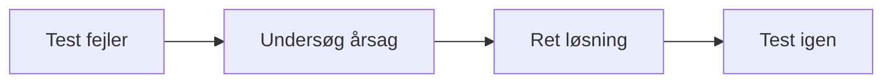

Flyt ikke Issue til Review, før løsningen virker.

---

# 5. Pull request

Når I selv har godkendt implementeringen:

```text
Implementeringen er kontrolleret.

Commit og push de relevante ændringer.

Opret en pull request til main.

Pull requesten skal:
- referere Issue
- beskrive ændringerne
- beskrive testresultaterne

Flyt derefter Issue til Review.

Du må ikke merge eller flytte Issue til Done.
```

---

# 6. Få et menneskeligt review

Et andet gruppemedlem, en anden gruppe eller underviseren reviewer pull requesten.

Hvis review finder problemer:

```text
Review
  ↓
In progress
  ↓
Ret
  ↓
Test
  ↓
Review
```

Når review er godkendt:

1. merge pull requesten
2. flyt Issue til `Done`

---

# Hele arbejdsformen

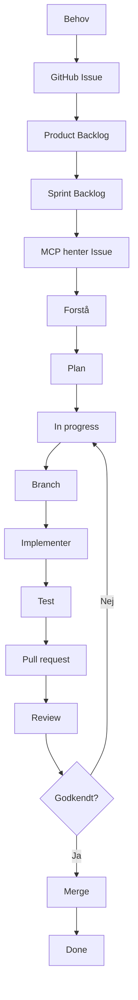

---

# Hvis I bliver færdige

De følgende opgaver er ekstra arbejde.

De er **ikke GitHub Issues endnu**.

Hvis I vil arbejde med en af dem, skal I først oprette et rigtigt GitHub Issue og tilføje det til Project.

---

## Ekstra opgave – markér bestilling som klar

### Titel

```text
Markér bestilling som klar
```

### Kopier dette ind i et nyt Issue

```markdown
## User story

Som medarbejder vil jeg kunne markere en bestilling som klar,
så det er tydeligt at den kan udleveres.

## Acceptkriterier

- En bestilling med status MODTAGET kan ændres til KLAR.
- Brugeren vælger bestillingen ud fra dens id.
- Et ukendt id afvises.
- En bestilling der allerede er KLAR ændres ikke igen.
- Programmet crasher ikke ved ugyldigt input.
```

---

## Ekstra opgave – vis ventende bestillinger

### Titel

```text
Vis antal ventende bestillinger
```

### Kopier dette ind i et nyt Issue

```markdown
## User story

Som medarbejder vil jeg kunne se antallet af ventende bestillinger,
så jeg hurtigt kan se hvor travlt køkkenet har.

## Acceptkriterier

- Programmet kan vise antal bestillinger med status MODTAGET.
- Bestillinger med status KLAR tælles ikke med.
- Resultatet opdateres når status ændres.
```

---

## Ekstra opgave – annullér bestilling

### Titel

```text
Annullér bestilling
```

### Kopier dette ind i et nyt Issue

```markdown
## User story

Som medarbejder vil jeg kunne annullere en bestilling,
så en forkert bestilling ikke bliver tilberedt.

## Acceptkriterier

- Brugeren kan vælge en bestilling ud fra id.
- En bestilling med status MODTAGET kan ændres til ANNULLERET.
- Et ukendt id afvises.
- En KLAR bestilling kan ikke annulleres.
```

---

# Del 8 – hvad skal I gøre i fremtidige projekter?

ByteBites er kun øvelsen.

Det vigtigste er, at I bagefter kan etablere arbejdsformen i et nyt projekt.

Når I starter et nyt projekt, skal I ikke bare åbne Copilot og skrive:

```text
Lav mit projekt.
```

I skal først skabe rammerne omkring Agenten.

---

## 1. Opret repository

Opret et GitHub repository og få startprojektet til at køre lokalt.

---

## 2. Opret projektets Copilot-instruktioner

Opret:

```text
.github/copilot-instructions.md
```

Beskriv de regler, der gælder for **det konkrete projekt**.

Eksempler:

* programmeringssprog og version
* frameworks
* arkitektur
* coding conventions
* teststrategi
* sikkerhed
* hvad Agent må ændre
* hvordan Issues håndteres
* hvornår noget er Done

Kopier ikke ukritisk ByteBites-reglerne.

Et Spring Boot-projekt skal naturligvis have andre regler end ByteBites.

---

## 3. Opret GitHub Project

Som minimum:

```text
Product Backlog
Sprint Backlog
In progress
Review
Done
```

---

## 4. Beskriv arbejdet som Issues

Et godt Issue bør som minimum fortælle:

```text
Hvad er behovet?

Hvad skal løsningen kunne?

Hvordan kan vi kontrollere at det virker?

Hvad er ikke en del af opgaven?
```

En god struktur kan være:

```markdown
## User story

Som ...
vil jeg ...
så ...

## Acceptkriterier

- ...
- ...
- ...

## Afgrænsning

- ...

## Test

- ...
```

Et uklart Issue giver Agenten et uklart mål.

---

## 5. Tilføj Issues til Project

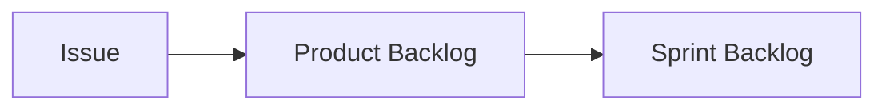

Det er mennesker, der prioriterer Product Backlog og vælger arbejdet til Sprint Backlog.

---

## 6. Kontroller MCP

Copilot skal kunne få adgang til:

* repository
* Issues
* pull requests
* GitHub Project

Test forbindelsen før I begynder udviklingen.

---

## 7. Arbejd fra Issue – ikke fra en løs prompt

Undgå:

```text
Lav login.
```

Brug i stedet:

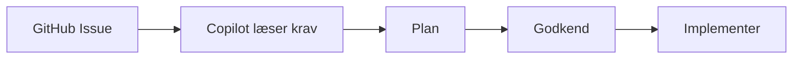

Issue bliver den fælles kilde til opgaven.

---

## 8. Bevar menneskelige kontrolpunkter

Agenten kan hjælpe med:

* finde Issue
* læse krav
* undersøge kode
* lave plan
* opdatere Project
* oprette branch
* implementere kode
* køre test
* committe
* pushe
* oprette pull request

Men udvikleren har stadig ansvaret for:

* prioritering
* krav
* arkitektur
* godkendelse af planen
* forståelse af koden
* test
* kvalitet
* review
* beslutningen om at noget er Done

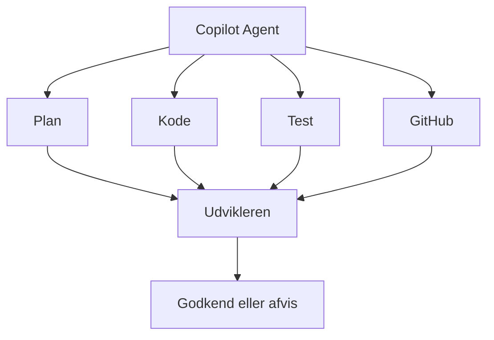

---

# Det vigtigste I skal tage med

Målet er ikke:

```text
Prompt
  ↓
AI skriver kode
  ↓
Færdig
```

Målet er:

```text
Behov
  ↓
Issue
  ↓
Plan
  ↓
Implementering
  ↓
Test
  ↓
Pull request
  ↓
Review
  ↓
Done
```

Med GitHub MCP kan Copilot arbejde direkte med de værktøjer, I allerede bruger.

Men det ændrer ikke på, hvem der har ansvaret.

**Agenten udfører arbejde. Udvikleren styrer processen og godkender resultatet.**
